

# **SIMONTRONI**
#### **Autor: David Roni Hernández Beltrán**

 
 

### **Este pequeño proyecto es de mi autoria y lo desarrolle para completar el curso: Programación física con Arduino de CODE IOT iniciativa de Nokia a continuación ajunto mi certificado obtenido trar terminar el curso.**

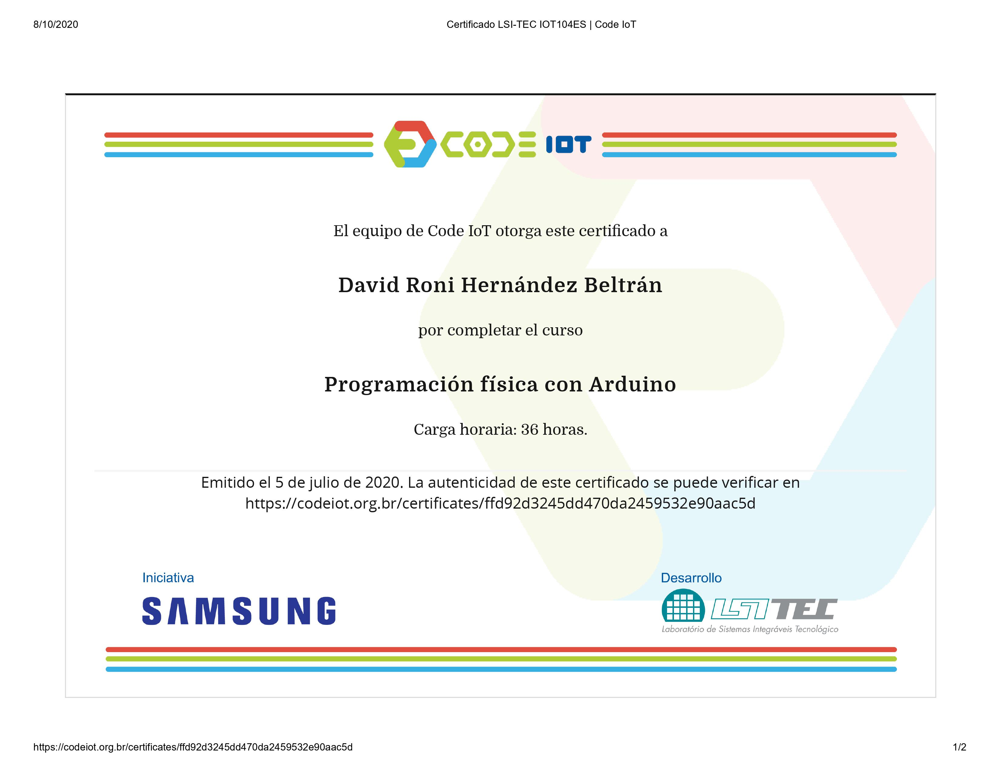

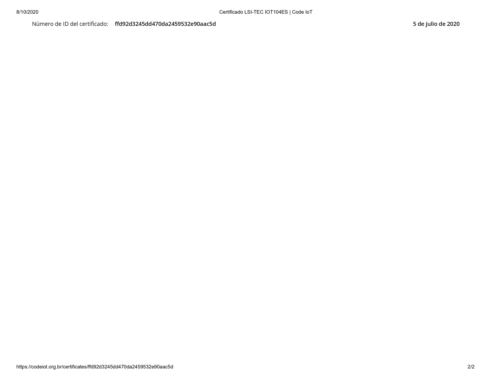

### **Video de youtube de mi autoria explicando el proyecto:**

### **Menu**

* [1) Prerrequisitos](#1-prerrequisitos)
    * [1.1) Materiales](#11-materiales)

* [2) Funcionamiento](#2-funcionamiento)

    * [2.0) Explicacion detallada](#20-explicacion-detallada)
    * [2.1) Explicacion breve](#21-explicacion-breve)
    * [2.2) Como jugar simon troni](#22-como-jugar-simon-troni)
    * [2.3) Explicacion del hadware del proyecto](#23-explicacion-del-hadware-del-proyecto)

* [3) Ensamble del proyecto](#3-ensamble-del-proyecto)
    * [3.1) Paso 1](#31-paso-1)
    * [3.2) Paso 2](#32-paso-2)
    * [3.3) Paso 3](#33-paso-3)

## **1) Prerrequisitos**

[Regresar al menu principal](#menu)

A continuación se enlistan los prerrequisitos para poder ejecutar el proyecto:

### **1.1) Materiales**

[Regresar al menu principal](#menu)

* 1-. Un buzzer pasivo

<!--style="margin-left:auto;margin-right:auto;width:100%;"-->

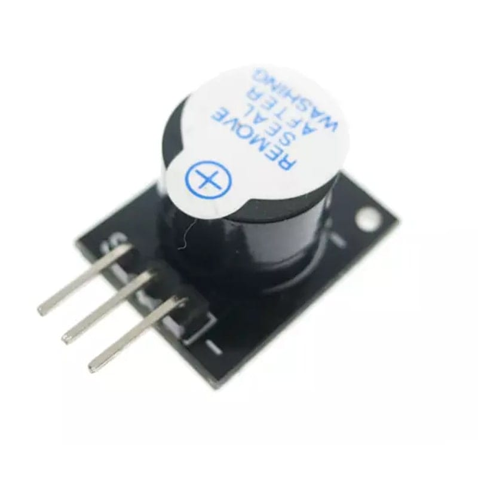

* 2-. Un potenciometro de 5k

<!--style="margin-left:auto;margin-right:auto;width:100%;"-->

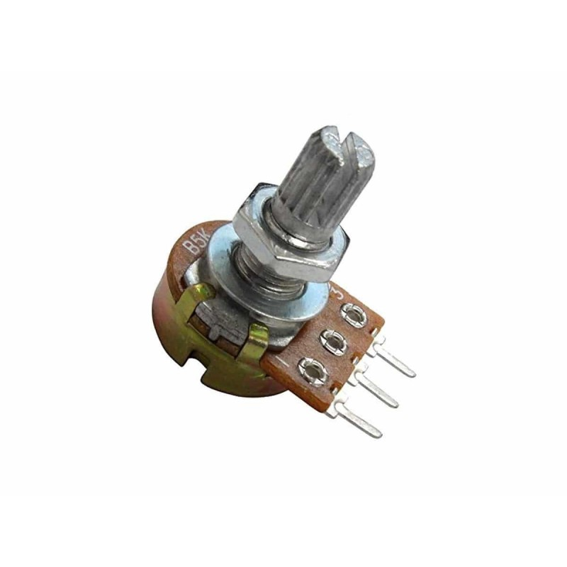

* 3-. Una resistencia de 220 [Ω] 

<!--style="margin-left:auto;margin-right:auto;width:100%;"-->

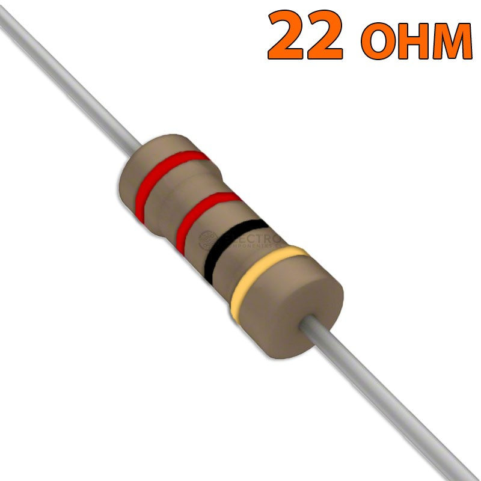

* 4-. Cuatro resistencias de 330 [Ω]  o de 220 [Ω]  

<!--style="margin-left:auto;margin-right:auto;width:100%;"-->

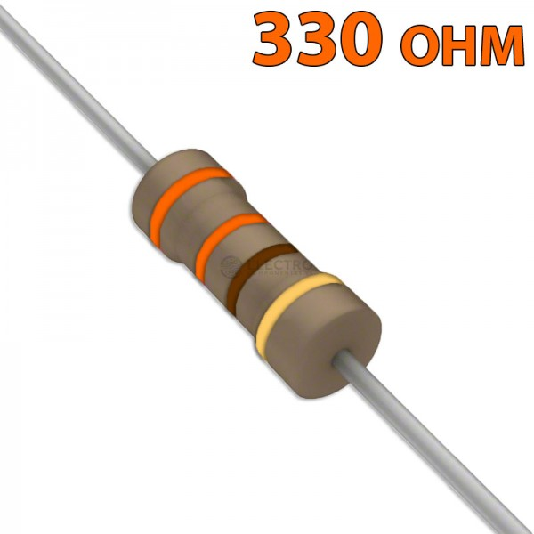

* 5-. Cuatro push button de 2 pines cada uno

<!--style="margin-left:auto;margin-right:auto;width:100%;"-->

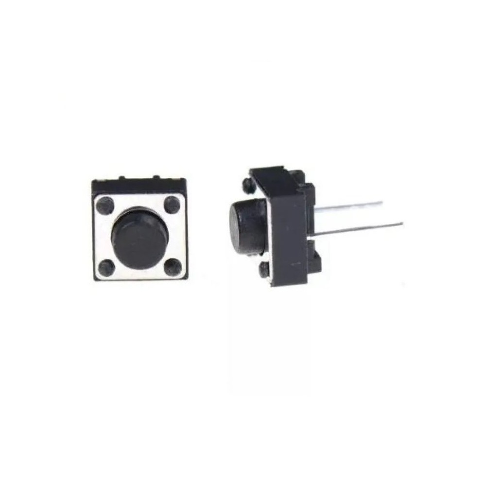

* 6-. Cuatro leds

<!--style="margin-left:auto;margin-right:auto;width:100%;"-->

* 7-. Un arduino uno con su cable respectivo

<!--style="margin-left:auto;margin-right:auto;width:100%;"-->

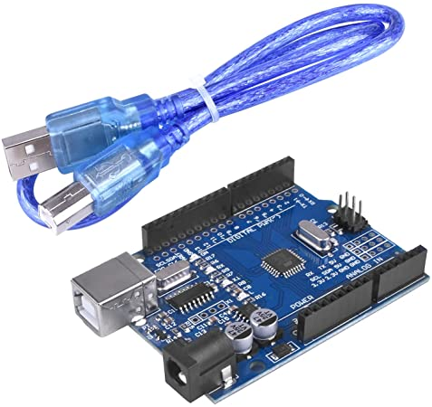

* 8-. Alambre de diferentes colores calibre 22(para conexiones en la protoboard) o jumpers macho, pero preferiblemente alambres

<!--style="margin-left:auto;margin-right:auto;width:100%;"-->

* 9-. Una computadora

<!--style="margin-left:auto;margin-right:auto;width:100%;"-->

* 10-. Una protoboard

<!--style="margin-left:auto;margin-right:auto;width:100%;"-->

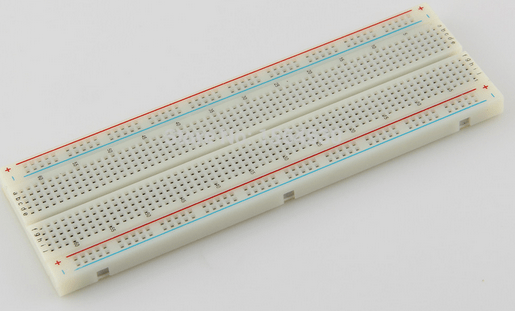

## **2) Funcionamiento** 

### **2.0) Explicacion detallada** 

[Regresar al menu principal](#menu)

Para ver una explicación mas detallada de todo lo que puede hacer este proyecto, puedes leer el siguiente pdf el cual es el reporte que realice de mi proyecto:
[Reporte de simon roni](1_reporte/Reporte_simonTroni_byDavidRoniHernandezBeltran.pdf)

### **2.1) Explicacion breve** 

[Regresar al menu principal](#menu)

El funcionamiento del juego es muy sencillo, se prende una secuencia de leds y el usuario debe repetir dicha secuencia pulsando los botones respectivos, a medida que avanzamos, por cada secuencia correcta digitada en la siguiente secuencia que se muestre se prendera 1 led más, y así sucesivamente hasta terminar el juego o perder el juego.

Para ver una explicación mas detallada de todo lo que puede hacer este proyecto, puedes leer el siguiente pdf el cual es el reporte que realice de mi proyecto:
[Reporte de simon roni](1_reporte/Reporte_simonTroni_byDavidRoniHernandezBeltran.pdf)

### **2.2) Como jugar simon troni** 

[Regresar al menu principal](#menu)

**PASO 1:** Para poder jugar con simonTroni debemos conectar el  Arduino a la computadora, pues el juego se comunica vía serial

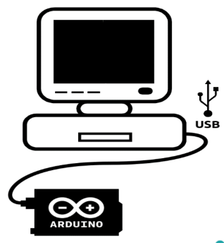

**PASO 2:** Debemos abrir el  IDE de Arduino, y cerciorar  que esta seleccionado el  puerto del Arduino uno  que conectamos:

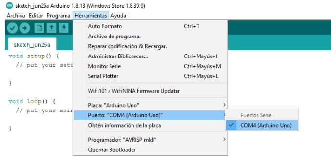

**PASO 3:** Necesitamos abrir el monitor serie del IDE de Arduino, así que damos clic  izquierdo sobre la lupa

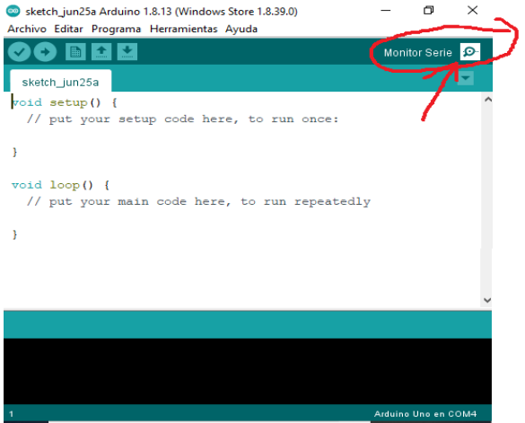

**PASO 4:** Antes de  hacer cualquier  cosa, lo primero que  debemos hacer es  maximizar la  pantalla, así que proseguiremos a darle clic izquierdo sobre el icono de maximizar:

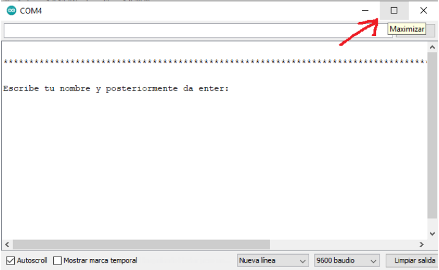

**PASO 5:** Podemos observar que nos pide que escribamos nuestro nombre y posteriormente tecleamos ENTER, pues eso  haremos…

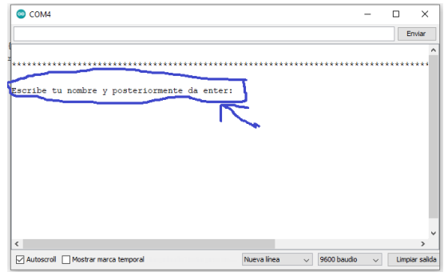

**PASO 6:** Seguir las siguientes instrucciones.

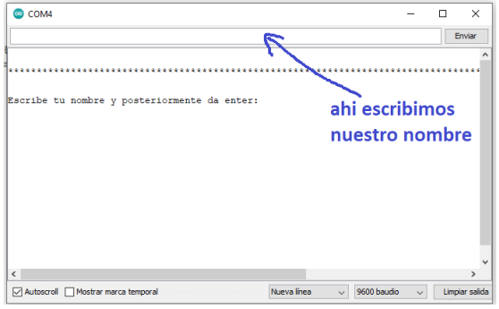

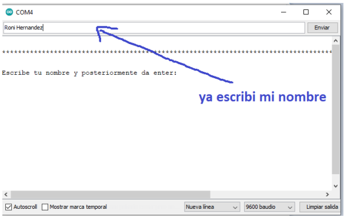

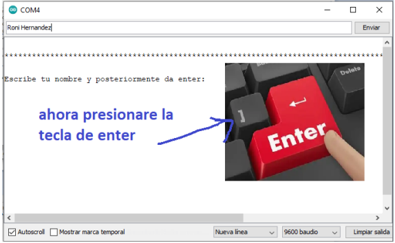

**PASO 7:** Observar que una vez realizado lo anterior, nos aparecerá el siguiente mensaje, diciéndonos que presionemos cualquier botón del juego para poder   iniciar el juego

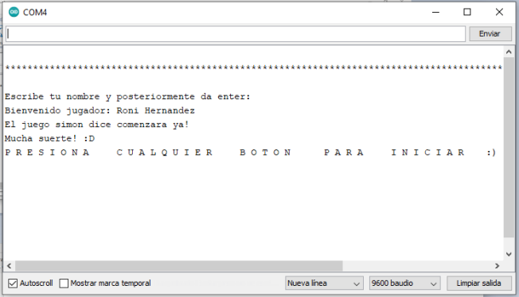

**PASO 8:** Presionamos cualquier botón del juego para poder iniciar el juego:

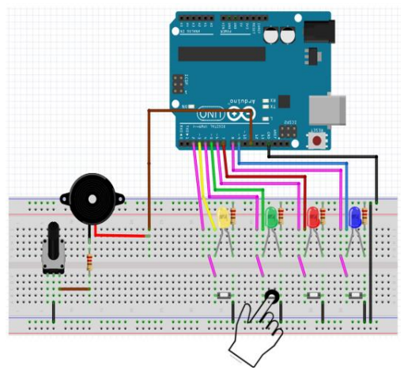

**PASO 9:** Finalmente el juego comenzara prendiendo un led al mismo tiempo que la bocina da un pitido. Nosotros deberemos presionar el botón del led que se prendió.

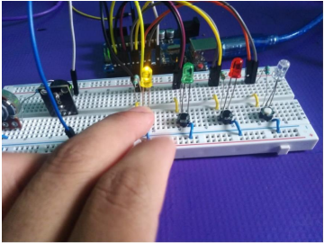

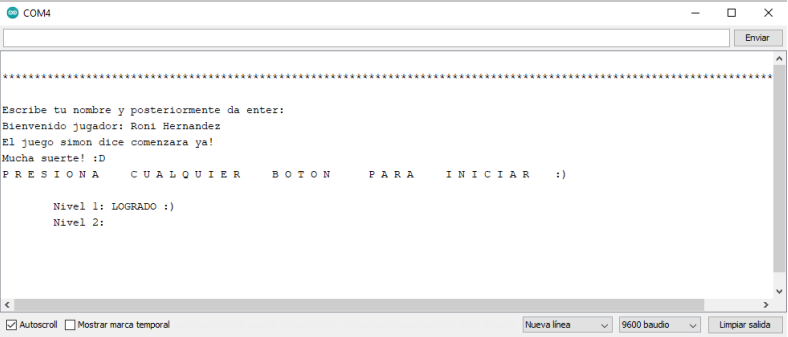

**PASO 10:** Si pulsamos el botón correcto del led que se prendió, pasaremos al siguiente nivel del  juego, el cual consistirá en presionar los botones en el orden respectivo de los 2 leds que se prenderán de forma cronológica. 

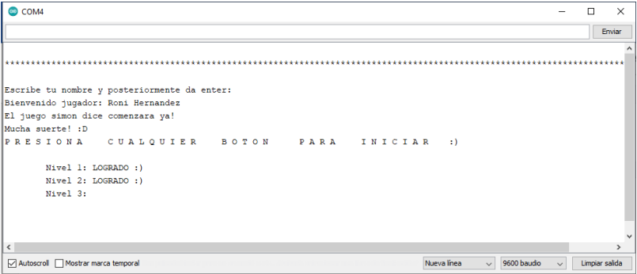

**PASO 11:** Si pulsamos los botones correctos en el orden correcto, pasaremos al siguiente nivel del  juego, el cual consistirá en presionar los botones en el orden respectivo, pero ahora de los 3 leds que se prenderán de forma cronológica.

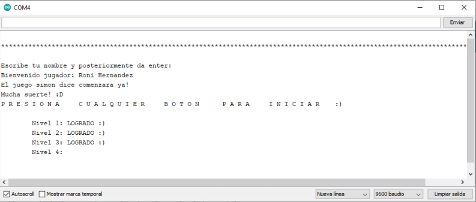

**PASO 12:** Y así seguirá el juego a medida que pasemos al siguiente nivel aumentará un led más el cual debemos memorizar.

**PASO 13:** Si perdemos el juego nos avisará que perdimos y nos dirá nuestra puntuación lograda, y si queremos volver a jugar debemos seguir los mismos pasos a partir del paso número 5.

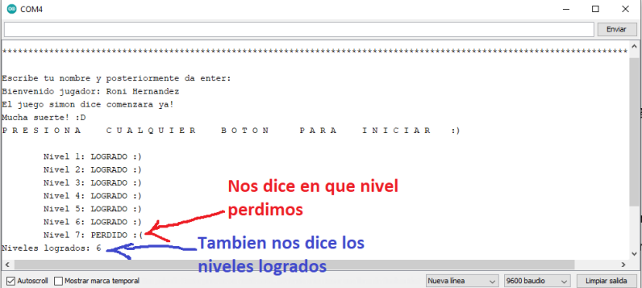

**PASO 14:** Si pasamos todos los niveles del juego, el juego nos avisara, y nos tocara una pieza musical  como recompensa de que hemos ganado, si queremos volver a jugar debemos seguir los mismos pasos a partir del paso número 5.

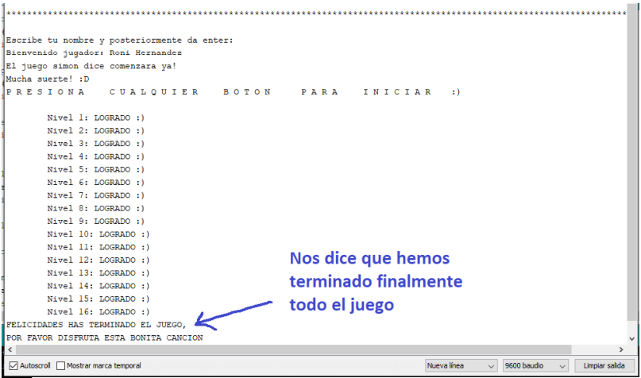

**PASO 15:** Si deseamos bajar el volumen del juego basta con girar el potenciómetro para ajustar el 
volumen del juego

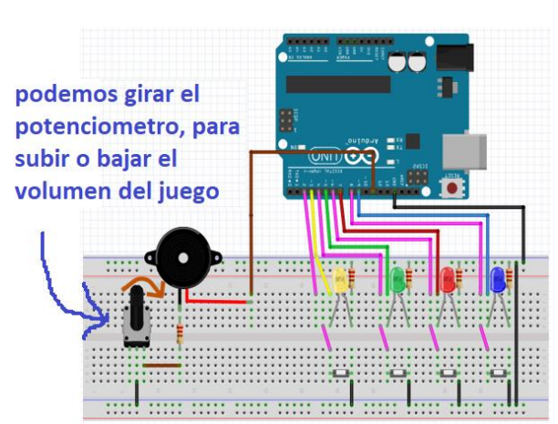

### **2.3) Explicación del hadware del proyecto**

[Regresar al menu principal](#menu)

El funcionamiento del juego es muy sencillo, se prende una secuencia de leds y el usuario debe repetir dicha secuencia pulsando los botones respectivos, a medida que avanzamos, por cada secuencia correcta digitada en la siguiente secuencia que se muestre se prendera 1 led más, y así sucesivamente hasta terminar el juego o perder el juego.

¿Explicación del hadware del proyecto hadware?

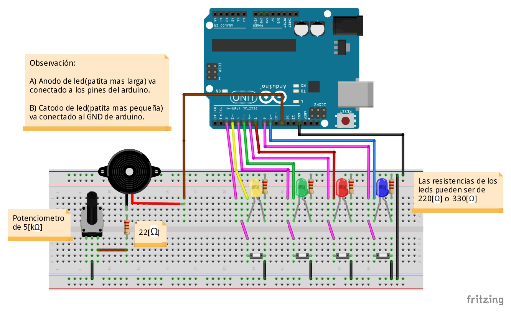

* Las resistencias de los leds son para limitar la corriente que pasa a través de ellos y así evitar dañar la placa Arduino o los leds por un flujo grande de corriente.

* El potenciómetro lo utilice para limitar la corriente que le llega al zumbador, de tal manera que si lo movemos alteramos la resistencia de este, lo cual ocasiona una alteración en la corriente, lo que 
significa una alteración en la potencia que recibe el zumbador, lo cual significa una variación en la intensidad del volumen del juego, es decir gracias al potenciometro se puede subir o bajar el volumn del juego. 

* La resistencia que une al potenciómetro con el zumbador sirve como medida de protección en caso de que el jugador decida subirle todo el volumen al juego (tener un potenciómetro con un resistencia de 0 [Ω] ) y así evitar que la corriente que fluya por el zumbador nunca sea muy grande pues no importando como gire el potenciómetro el jugador, la resistencia mínima siempre serán 
22[Ω].

* Todos los botones están conectados de un pin de Arduino al GND de Arduino, debido a que active 
la resistencia interna de los pines que van conectados a los botones, declarando esos pines como 
pines: INPUT_PULLUUP

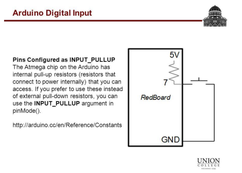

De esa manera me ahorro el trabajo extra de colocar resistencias externas para los botones:

Las imágenes fueron obtenidas de las siguientes fuentes de información: 

* https://slideplayer.com/slide/4469076/
* https://forum.arduino.cc/index.php?topic=575915.0

## **3) Ensamble del proyecto**

[Regresar al menu principal](#menu)

### **3.1) Paso 1**

[Regresar al menu principal](#menu)

Cumplir con todos los prerrequisitos ya mencionados anteriormente, es decir **conseguir el material**

  * [1) Ir al apartado de  prerrequisitos](#1-prerrequisitos)
      * [1.1) Ir al apartado de materiales](#11-materiales)

### **3.2) Paso 2**

[Regresar al menu principal](#menu)

* Cargar el script  que se encuentra en: <<**2_codigo/proyecto_RoniHernandez**>>  en el arduino uno

  [dar clic aqui para ver el script proyecto_RoniHernandez](2_codigo/proyecto_RoniHernandez)

### **3.3) Paso 3**

[Regresar al menu principal](#menu)

Armar el **diagrama del circuito del proyecto**:

[dar clic aqui para ver circuito de manera mas legible](3_circuito/diagrama_simonTroni_byDavidRoniHernandezBeltran.pdf)

